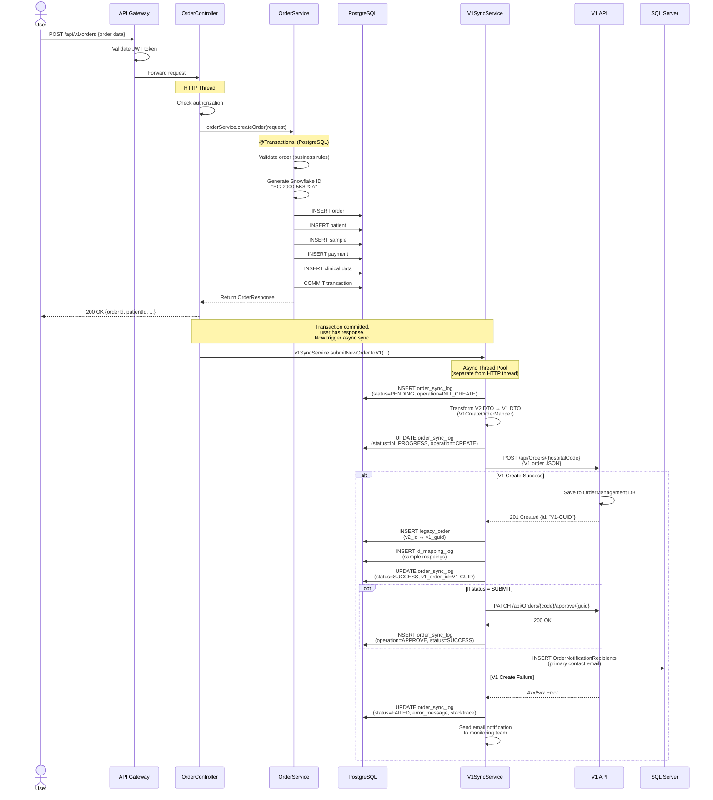
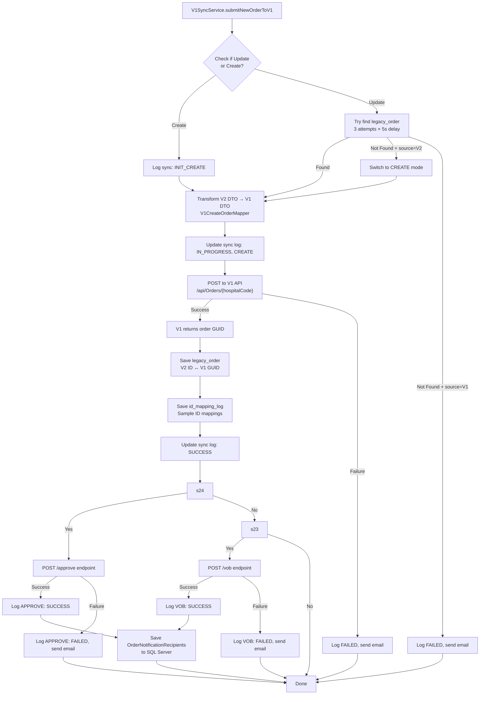
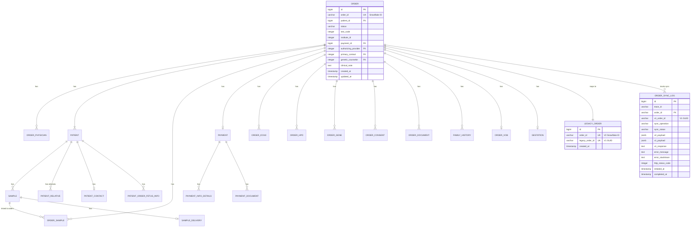
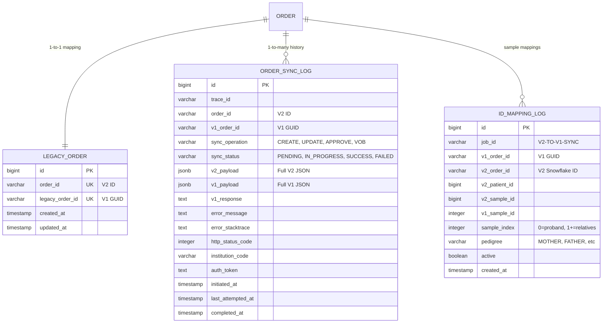

# Complete V2 ↔ V1 Order Creation & Synchronization Guide

**Welcome!** This guide will help you understand how order creation works in the CEP system, specifically how the new V2 system (Java/Spring Boot) synchronizes data with the legacy V1 system (.NET).

---

## Table of Contents

1. [Executive Summary - Start Here](#1-executive-summary---start-here)
2. [Why Two Systems Exist](#2-why-two-systems-exist)
3. [System Architecture Overview](#3-system-architecture-overview)
4. [Database Architecture](#4-database-architecture)
5. [The Complete Order Creation Flow](#5-the-complete-order-creation-flow)
6. [V2 → V1 Synchronization Deep Dive](#6-v2--v1-synchronization-deep-dive)
7. [Understanding the Code Structure](#7-understanding-the-code-structure)
8. [Common Scenarios & Examples](#8-common-scenarios--examples)
9. [Troubleshooting Guide](#9-troubleshooting-guide)
10. [Your First Week Action Plan](#10-your-first-week-action-plan)

---

## 1. Executive Summary - Start Here

### What You Need to Know in 2 Minutes

**The Situation:**
- Baylor Genetics is migrating from a legacy .NET order management system (V1) to a new Java/Spring Boot system (V2)
- During this migration phase, BOTH systems are running simultaneously
- When a doctor creates an order in V2, it must be synchronized to V1 so the lab can process it

**How It Works:**
1. User submits order via V2 REST API → Data saved to **PostgreSQL** database
2. V2 transaction commits successfully
3. **Asynchronously** (in a separate thread), V2 transforms the data and sends it to V1's REST API
4. V1 receives the data → Saves to its own **SQL Server** database
5. Both systems now have the order (with different IDs and formats)

**Key Players:**
- **PostgreSQL (cep_order_management)**: V2's database - where NEW orders are created
- **SQL Server (CustomerManagement, MGL)**: Shared databases for physician/test reference data
- **V1 REST API**: Legacy system's HTTP interface
- **Async Thread Pool**: Handles V2→V1 sync without blocking the user

**The Critical Rule:**
> The V2 database is the source of truth for new orders. V1 gets a synchronized copy but doesn't dictate what V2 stores.

---

## 2. Why Two Systems Exist

###  The Migration Story

**2018-2023: V1 Era**
- Legacy .NET system handling all orders
- SQL Server database
- Tightly coupled with LIMS (Laboratory Information Management System)
- Worked fine but hard to modernize

**2024-Present: V2 Migration**
- New Java 21 + Spring Boot 3.2.6 microservices
- PostgreSQL for new data
- Modern REST APIs
- Cloud-native architecture

**The Challenge:**
You can't flip a switch and replace an entire lab system overnight. The lab staff still use V1 tools, and LIMS is integrated with V1. So we must:

1. Accept new orders in V2 (better API, modern tech)
2. Sync them to V1 (so LIMS can process samples)
3. Eventually migrate everything and decommission V1

**Timeline:**
- **Right Now**: Dual operation - V2 creates orders, syncs to V1
- **Future**: V1 decommissioned, V2 becomes the only system

---

## 3. System Architecture Overview

### The Big Picture

```
┌─────────────────────────────────────────────────────────────────┐
│                        USER / CLIENT                            │
│            (Web UI, Mobile App, Third-Party System)             │
└────────────────────────────┬────────────────────────────────────┘
                             │
                             │ HTTPS
                             ▼
┌─────────────────────────────────────────────────────────────────┐
│                     cep-api-gateway                             │
│                  (Spring Cloud Gateway)                         │
│                 Routes requests to services                     │
└────────────────────────────┬────────────────────────────────────┘
                             │
                             ▼
┌─────────────────────────────────────────────────────────────────┐
│                    cep-order-service                            │
│          (Java 21 + Spring Boot 3.2.6 - WAR)                    │
│                                                                 │
│  POST /api/v1/orders  ┌───────────────────────────────────┐    │
│         ↓             │  OrderController.java             │    │
│         ↓             │         ↓                         │    │
│  @Transactional       │  OrderServiceImpl.java            │    │
│   (PostgreSQL)        │   - Validate                      │    │
│         ↓             │   - Generate Snowflake ID         │    │
│   Save to DB          │   - Save Order                    │    │
│         ↓             │   - Save Patient                  │    │
│   COMMIT              │   - Save Samples                  │    │
│         ↓             │   - Save Payment                  │    │
│  Return 200 OK        │   - Save Clinical Data            │    │
│         ↓             └───────────────────────────────────┘    │
│  Trigger Async Sync ────────────────────┐                      │
│                                          │                      │
└──────────────────────────────────────────┼──────────────────────┘
                                           │
                      ┌────────────────────▼────────────────────┐
                      │   V1SyncServiceImpl.java                │
                      │   (Async Thread Pool - 10 threads)      │
                      │                                          │
                      │  1. Transform V2 DTO → V1 DTO           │
                      │  2. POST to V1 API (create order)       │
                      │  3. Save legacy_order mapping           │
                      │  4. Log sync status                     │
                      │  5. Send APPROVE if status=SUBMIT       │
                      │                                          │
                      └────────────────────┬────────────────────┘
                                           │
                                           │ HTTP POST/PATCH
                                           ▼
┌─────────────────────────────────────────────────────────────────┐
│                       V1 System (.NET)                          │
│          ordering-api-qa.baylorgenetics.com                     │
│                                                                 │
│  POST /api/Orders/{hospitalCode}                                │
│  PATCH /api/Orders/{hospitalCode}/approve/{orderId}             │
│                                                                 │
│               ↓                                                 │
│      Save to SQL Server                                         │
│      (OrderManagement DB)                                       │
└─────────────────────────────────────────────────────────────────┘

┌─────────────────────────────────────────────────────────────────┐
│                      DATABASES                                  │
│                                                                 │
│  ┌──────────────────────┐  ┌──────────────────────┐            │
│  │   PostgreSQL         │  │   SQL Server         │            │
│  │ cep-order-management │  │  CustomerManagement  │            │
│  │                      │  │  (Physicians/Insts)  │            │
│  │  - order             │  │  READ-ONLY for V2    │            │
│  │  - patient           │  │                      │            │
│  │  - sample            │  │  MGL                 │            │
│  │  - payment           │  │  (Genes/ICD/Tests)   │            │
│  │  - order_sync_log    │  │  READ-ONLY for V2    │            │
│  │  - legacy_order      │  │                      │            │
│  │  - id_mapping_log    │  │  OrderManagement     │            │
│  │                      │  │  (V1's Orders)       │            │
│  │  ALL WRITES          │  │  V1 WRITES           │            │
│  └──────────────────────┘  └──────────────────────┘            │
└─────────────────────────────────────────────────────────────────┘
```

### Key Components Explained

**cep-api-gateway:**
- Entry point for all API requests
- Routes to appropriate microservice
- Handles Auth0 JWT validation

**cep-order-service:**
- Main service for order creation/update/retrieval
- Owns the order creation transaction
- Triggers V1 sync

**V1SyncService:**
- Runs in separate thread pool (10 threads)
- Transforms V2 data model to V1 data model
- Makes HTTP calls to V1 REST API
- Logs all sync operations

**PostgreSQL (cep-order-management):**
- V2's primary database
- Schema: `cep_core` (application data)
- Schema: `cep_core_audit` (Hibernate Envers audit trail)

**SQL Server Databases:**
- `CustomerManagement`: Physician and institution master data (shared, READ-ONLY for V2)
- `MGL`: Gene catalog, ICD codes, test definitions (shared, READ-ONLY for V2)
- `OrderManagement`: V1's order data (V1 owns, V2 doesn't touch)

---

## 4. Database Architecture

### Database Layout

```
┌──────────────────────────────────────────────────────────────────────┐
│                     V2 WRITES HERE                                   │
│                                                                      │
│  PostgreSQL Server: cep-order-management                             │
│                                                                      │
│  Schema: cep_core                                                    │
│  ├── order (main order record)                                      │
│  ├── patient (patient demographics)                                 │
│  ├── sample (specimen information)                                  │
│  ├── order_sample (junction table)                                  │
│  ├── order_physician (doctor associations)                          │
│  ├── payment (billing info)                                         │
│  ├── payment_info_details (insurance details)                       │
│  ├── order_icd10 (diagnosis codes)                                  │
│  ├── order_hpo (phenotype terms)                                    │
│  ├── order_gene (genes of interest)                                 │
│  ├── order_consent (consent forms)                                  │
│  ├── family_history                                                 │
│  ├── order_document (attached files)                                │
│  ├── gestation (prenatal info)                                      │
│  ├── patient_order_fetus_info                                       │
│  ├── prenatal_imaging                                               │
│  ├── prenatal_testing_status                                        │
│  ├── order_vob (VOB orders)                                         │
│  ├── care_team_member                                               │
│  ├── order_care_team_member                                         │
│  │                                                                   │
│  │   ┌────────────────────────────────────┐                         │
│  │   │  SYNC TRACKING TABLES              │                         │
│  │   │  (critical for debugging)          │                         │
│  │   ├────────────────────────────────────┤                         │
│  │   │  order_sync_log                    │                         │
│  │   │  - Logs every V1 sync attempt      │                         │
│  │   │  - Stores V2 request, V1 request   │                         │
│  │   │  - Stores V1 response, errors      │                         │
│  │   │                                    │                         │
│  │   │  legacy_order                      │                         │
│  │   │  - Maps V2 Snowflake ID ↔ V1 GUID │                         │
│  │   │  - Created after successful sync   │                         │
│  │   │                                    │                         │
│  │   │  id_mapping_log                    │                         │
│  │   │  - Maps V2 sample IDs ↔ V1 IDs    │                         │
│  │   │  - One row per sample              │                         │
│  │   └────────────────────────────────────┘                         │
│  │                                                                   │
│  Schema: cep_core_audit (Hibernate Envers - automatic)              │
│  ├── order_aud                                                      │
│  ├── patient_aud                                                    │
│  ├── sample_aud                                                     │
│  └── ... (audit table for every entity)                             │
└──────────────────────────────────────────────────────────────────────┘

┌──────────────────────────────────────────────────────────────────────┐
│                     V2 READS FROM HERE                               │
│                     (SHARED REFERENCE DATA)                          │
│                                                                      │
│  SQL Server: CustomerManagement                                      │
│  Schema: dbo                                                         │
│  ├── Customers (physicians, institutions)                           │
│  └── CustomerTests (which tests each institution offers)            │
│                                                                      │
│  SQL Server: MGL                                                     │
│  Schema: dbo                                                         │
│  ├── ICD10Codes (diagnosis code descriptions)                       │
│  ├── HgncGenes (gene information)                                   │
│  └── Tests (test catalog)                                           │
└──────────────────────────────────────────────────────────────────────┘

┌──────────────────────────────────────────────────────────────────────┐
│                     V1 WRITES HERE                                   │
│                     (V2 NEVER TOUCHES)                               │
│                                                                      │
│  SQL Server: OrderManagement (V1's database)                         │
│  Schema: dbo                                                         │
│  ├── Orders (V1's order table - different structure than V2)        │
│  ├── Samples                                                        │
│  ├── Patients                                                       │
│  └── ... (V1's complete data model)                                 │
│                                                                      │
│  **V2 ONLY accesses this via V1's REST API**                         │
└──────────────────────────────────────────────────────────────────────┘
```

### Understanding Snowflake IDs

**What is a Snowflake ID?**

A Snowflake ID is a unique identifier generated by the application (not the database). Example: `BG-2900-5K8P2A`

**Structure:**
```
BG-2900-5K8P2A
│   │    │
│   │    └─── Random component (collision-resistant)
│   └──────── Machine/Server ID (supports distributed systems)
└──────────── Prefix (human-readable, indicates Baylor Genetics)
```

**Why Use Snowflake IDs?**
1. **No Database Round-Trip**: Generated in Java code, not by DB auto-increment
2. **Distributed-Safe**: Multiple servers can generate IDs without collision
3. **Time-Sortable**: IDs generated later sort after IDs generated earlier
4. **Doesn't Leak Volume**: Unlike sequential IDs (1, 2, 3...), you can't tell how many orders exist
5. **Human-Readable**: "BG-" prefix makes it obvious this is a Baylor Genetics order ID

**Code Location:**
```java
// services/cep-order-service/.../SnowflakeOrderIdGenerator.java
String orderId = snowflakeGenerator.generateOrderId();
// Returns: "BG-2900-5K8P2A"
```

---

## 5. The Complete Order Creation Flow

### Step-by-Step: What Happens When You Click "Submit Order"



### Breaking Down Each Step

#### Phase 1: HTTP Request Arrives

**What Happens:**
- User (web UI, mobile app, or third-party system) sends POST request to `/api/v1/orders`
- API Gateway validates Auth0 JWT token
- Request routed to `cep-order-service`

**Key File:**
```
services/cep-order-service/src/main/java/com/baylor/ceporderservice/controller/OrderController.java:48-86
```

**Code Snippet:**
```java
@PostMapping()
public ResponseEntity<ApiResponse<OrderResponse>> createOrder(
    @Valid @RequestBody CreateOrderRequest requestDto) {
    
    // 1. Check security
    SecurityUtil.authorizeUserToCreateOrder();
    SecurityUtil.authorizedInstitutionCodes(List.of(requestDto.getInstituteCode()));
    
    // 2. Create order (opens transaction)
    var response = orderService.createOrder(requestDto);
    
    // 3. Trigger async V1 sync (after transaction commits)
    v1SyncService.submitNewOrderToV1(requestDto, response.getData(), ...);
    
    return ResponseEntity.ok(response);
}
```

#### Phase 2: Validation

**What Happens:**
- Bean Validation (@Valid annotations) run first
- Custom business validations run second
- Two validation modes: **DraftValidation** (minimal) vs **SubmitValidation** (strict)

**Validation Examples:**

| Validation | Draft Mode | Submit Mode |
|------------|------------|-------------|
| Patient name required | ❌ Optional | ✅ Required |
| Sample type required | ❌ Optional | ✅ Required |
| Order summary HTML required | ❌ Not checked | ✅ Required |
| ICD codes required for insurance | ❌ Not checked | ✅ Required |
| Insurance details required | ❌ Not checked | ✅ Required |

**Why Two Modes?**
- **Draft**: Auto-save feature - user can save incomplete forms
- **Submit**: Final submission - must be complete before lab can process

**Key Files:**
```
services/cep-order-service/src/main/java/com/baylor/ceporderservice/validator/OrderRequestValidator.java
services/cep-order-service/src/main/java/com/baylor/ceporderservice/validator/SubmitOrderValidator.java
```

#### Phase 3: Database Transaction (The Main Event)

**What Happens:**
All database writes happen in ONE transaction. If ANY step fails, EVERYTHING rolls back.

**Transaction Scope:**
```java
@Transactional(transactionManager = "orderManagementTransactionManager")
public ApiResponse<OrderResponse> createOrder(CreateOrderRequest requestDto) {
    // Everything below is in ONE transaction
    
    // Step 1: Generate ID
    String orderId = snowflakeGenerator.generateOrderId();
    
    // Step 2-20: Save all entities (18 steps total)
    orderRepository.save(order);
    patientIntegrationService.handlePatientForOrder(...);
    addPaymentInformation(...);
    addICD10Codes(...);
    addHPOTerms(...);
    // ... and so on
    
    return response;
    // Transaction commits here automatically
}
```

**Tables Written (Typical Order):**

1. `cep_core.order` - Main order record
2. `cep_core.order_physician` - Doctor associations (1-3 rows)
3. `cep_core.patient` - Patient demographics
4. `cep_core.sample` - Sample information (1+ rows for family testing)
5. `cep_core.order_sample` - Links samples to order
6. `cep_core.payment` - Payment method
7. `cep_core.payment_info_details` - Insurance details (1-3 rows)
8. `cep_core.order_icd10` - Diagnosis codes (0+ rows)
9. `cep_core.order_hpo` - Phenotype terms (0+ rows)
10. `cep_core.order_gene` - Genes of interest (0+ rows)
11. `cep_core.order_consent` - Consent forms (0+ rows)
12. `cep_core.family_history` - Family medical history (0-5 rows)
13. `cep_core.order_document` - Attached PDFs (SUBMIT only)
14. ... plus audit tables automatically

**Minimum Data for Simple Order:**
- Order
- Patient
- Sample
- Order-Sample link
- Order-Physician link
- Payment (even if "DO NOT BILL")

**Key File:**
```
services/cep-order-service/src/main/java/com/baylor/ceporderservice/domain/service/impl/OrderServiceImpl.java:222-416
```

#### Phase 4: Transaction Commits

**What Happens:**
- Spring commits the PostgreSQL transaction
- All data is now visible in the database
- User gets 200 OK response with:
  - Order ID (Snowflake ID)
  - Patient ID
  - Sample IDs
  - All other generated IDs

**Response Example:**
```json
{
  "success": true,
  "code": "ORD_1001",
  "message": "Order created successfully",
  "data": {
    "orderId": "BG-2900-5K8P2A",
    "status": "SUBMIT",
    "patient": {
      "id": 11111,
      "firstName": "Jane",
      "lastName": "Doe",
      "sample": {
        "id": 44441,
        "sampleType": "BLOOD"
      }
    },
    "payment": {
      "id": 33331,
      "method": "INSURANCE"
    }
  },
  "timestamp": "2026-05-07T10:15:30Z"
}
```

#### Phase 5: Async V1 Sync Triggers

**What Happens:**
- Controller method calls `v1SyncService.submitNewOrderToV1()`
- This is NOT in the transaction (transaction already committed)
- Sync runs on a separate thread pool

**Critical Insight:**
```java
// In OrderController:
var response = orderService.createOrder(requestDto);  // ← Transaction commits here

// Now we're OUTSIDE the transaction
v1SyncService.submitNewOrderToV1(...);  // ← Runs async, can fail without affecting V2
```

**Why Async?**
1. **User Experience**: User gets immediate response (don't wait for V1)
2. **Resilience**: If V1 is down, V2 order still saves
3. **Performance**: Don't block HTTP threads on V1 calls

**Thread Pool Configuration:**
```java
@Bean(name = "v1SyncExecutor")
public Executor v1SyncExecutor() {
    ThreadPoolTaskExecutor executor = new ThreadPoolTaskExecutor();
    executor.setCorePoolSize(10);  // 10 concurrent syncs max
    executor.setMaxPoolSize(10);
    executor.setQueueCapacity(100);
    executor.setThreadNamePrefix("v1-sync-");
    return executor;
}
```

---

## 6. V2 → V1 Synchronization Deep Dive

This is the most complex part of the system. Let's break it down step by step.

### The Sync Flow



### Step 1: Determine Create vs Update

**The Decision:**

When V1 sync is triggered, it must decide:
- **CREATE**: This is a brand new order (V2-originated)
- **UPDATE**: This order already exists in V1 (migrated from V1 or previously synced)

**How It Decides:**

```java
// Check legacy_order table
Optional<LegacyOrder> legacyOrder = legacyOrderRepository.findByOrderId(v2OrderId);

if (legacyOrder.isPresent()) {
    // UPDATE mode: We have V1 GUID, send PATCH with delta
    String v1Guid = legacyOrder.get().getLegacyOrderId();
    executeUpdateOrderInV1(v1Guid, newRequest, oldRequest);
} else {
    // CREATE mode: No mapping exists, send POST
    executeCreateOrderInV1(requestDto);
}
```

**Retry Logic for Updates:**

Sometimes the `legacy_order` row hasn't been inserted yet (race condition). The sync retries 3 times with 5-second delays:

```java
for (int attempt = 1; attempt <= maxAttempts; attempt++) {
    Optional<LegacyOrder> legacyOrder = legacyOrderRepository.findByOrderId(v2OrderId);
    if (legacyOrder.isPresent()) {
        return legacyOrder.get();
    }
    if (attempt < maxAttempts) {
        Thread.sleep(intervalSeconds * 1000);
    }
}

// After 3 attempts (15 seconds total):
if (order.getSource().equals("OOPV2")) {
    log.warn("Switching to CREATE mode for V2-sourced order");
    return null;  // Triggers CREATE
} else {
    throw new V1SyncException("Cannot find V1 order ID");
}
```

### Step 2: Transform V2 Data Model → V1 Data Model

This is where the magic (and complexity) happens. V2 and V1 have completely different data structures.

**The Challenge:**

| Aspect | V2 (PostgreSQL) | V1 (SQL Server) |
|--------|----------------|-----------------|
| Order ID | Snowflake String: "BG-2900-5K8P2A" | GUID: "550e8400-e29b-41d4-a716-446655440000" |
| Patient Structure | Separate `patient` table | Embedded in order JSON |
| Sample Structure | `sample` + `order_sample` junction | Array in order JSON |
| Relatives | `patient_relative` table | `patients[]` array with `testIndex` |
| Payment | `payment` + `payment_info_details` | Nested in order JSON |
| Consent | `order_consent` table | `consents[]` array with test-level expansion |
| Status Values | "DRAFT", "SUBMIT", "VOB_DRAFT", "VOB_SENT" | Boolean flags: `isVOB`, `vobStatus` |

**The Mapper:**

```
services/cep-order-service/src/main/java/com/baylor/ceporderservice/v1sync/mapper/V1CreateOrderMapper.java
```

**Mapping Examples:**

#### Example 1: Patient Data Duplication

V1 requires patient data in TWO places (a quirk of their API):

```java
// V2 has patient in one place:
{
  "patient": {
    "firstName": "Jane",
    "lastName": "Doe",
    "dateOfBirth": "1985-03-15"
  }
}

// V1 needs it TWICE:
{
  "patient": {  // Top-level patient object
    "firstName": "Jane",
    "lastName": "Doe",
    "dateOfBirth": "1985-03-15"
  },
  "patients": [  // Also in array
    {
      "firstName": "Jane",
      "lastName": "Doe",
      "dateOfBirth": "1985-03-15"
    }
  ]
}
```

#### Example 2: Enum Transformations

```java
// V2 → V1 Gender Mapping
V2: "MALE"    → V1: "M"
V2: "FEMALE"  → V1: "F"
V2: "INTERSEX" → V1: "U"  (Unknown)
V2: "UNKNOWN" → V1: "U"

// V2 → V1 Relationship Mapping
V2: "MOTHER"                  → V1: "Mother"
V2: "MATERNAL_GRANDMOTHER"    → V1: "Maternal Grandmother"
V2: "PATERNAL_AUNT"           → V1: "Paternal Aunt"

// V2 → V1 Payment Method
V2: "INSURANCE"        → V1: "Insurance"
V2: "PATIENT_SELF_PAY" → V1: "Patient (Self Pay)"
V2: "CLIENT_BILLING"   → V1: "Client Billing"
V2: "DO_NOT_BILL"      → V1: "Do Not Bill"
```

#### Example 3: Sentinel Values

V1 doesn't accept `null` for some fields, requiring sentinel strings instead:

```java
// V2 → V1 Accession Number
V2: null         → V1: "Na"  (sentinel value)

// V2 → V1 MRN (Medical Record Number)
V2: null         → V1: "None"  (sentinel value)

// V2 → V1 Email Notification
V2: []           → V1: {"EmailNotificationRecipient": ""}  (empty string, not null)
```

### Step 3: POST to V1 API

**The HTTP Call:**

```java
// Build V1 request
V1CreateOrderRequestDto v1Request = V1CreateOrderMapper.toV1CreateOrderRequest(
    requestDto,
    orderResponse,
    reanalysisContext
);

// POST to V1
WebClient.RequestHeadersSpec<?> spec = v1ApiClient.getWebClient()
    .post()
    .uri("/api/Orders/" + hospitalCode)
    .header("Authorization", "Bearer " + authToken)
    .header("Content-Type", "application/json")
    .bodyValue(v1Request);

// Execute (blocking call)
V1CreateOrderResponseDto v1Response = spec.retrieve()
    .bodyToMono(V1CreateOrderResponseDto.class)
    .block();

String v1OrderGuid = v1Response.getId();  // V1's UUID for this order
```

**V1 API Endpoint:**
```
POST https://ordering-api-qa.baylorgenetics.com/api/Orders/{hospitalCode}
Authorization: Bearer {JWT}
Content-Type: application/json
```

**V1 Response Example:**
```json
{
  "id": "550e8400-e29b-41d4-a716-446655440000",
  "hospitalCode": "BMGL",
  "status": "Pending",
  "samples": [
    {
      "id": 77777,
      "sampleType": "Blood"
    }
  ]
}
```

### Step 4: Save Sync Tracking Data

After V1 successfully creates the order, V2 must record the mapping:

#### Table 1: legacy_order

**Purpose**: Maps V2 Snowflake ID ↔ V1 GUID

```sql
INSERT INTO cep_core.legacy_order (
    order_id,           -- 'BG-2900-5K8P2A' (V2 Snowflake ID)
    legacy_order_id,    -- '550e8400-e29b-41d4-a716-446655440000' (V1 GUID)
    created_at,
    updated_at
) VALUES (...);
```

**Why This Matters:**
- When user updates the order in V2, we need to find the V1 GUID to send PATCH
- When user views order, we can show "V1 Order ID: 550e8400..."

#### Table 2: order_sync_log

**Purpose**: Complete audit trail of every sync attempt

```sql
-- Initially created with PENDING status
INSERT INTO cep_core.order_sync_log (
    trace_id,           -- UUID for tracking
    order_id,           -- V2 Snowflake ID
    sync_operation,     -- 'INIT_CREATE'
    sync_status,        -- 'PENDING'
    v2_payload,         -- Full V2 JSON (JSONB)
    institution_code,   -- 'BMGL'
    initiated_at
) VALUES (...);

-- Updated to IN_PROGRESS when calling V1
UPDATE order_sync_log
SET sync_operation = 'CREATE',
    sync_status = 'IN_PROGRESS',
    v1_payload = '{...}',  -- Full V1 JSON (JSONB)
    last_attempted_at = NOW()
WHERE order_id = 'BG-2900-5K8P2A';

-- Updated to SUCCESS after V1 responds
UPDATE order_sync_log
SET sync_status = 'SUCCESS',
    v1_order_id = '550e8400-...',
    v1_response = '{...}',
    completed_at = NOW(),
    http_status_code = 201
WHERE order_id = 'BG-2900-5K8P2A';
```

**What Gets Logged:**

| Column | What It Stores |
|--------|----------------|
| `v2_payload` | Entire CreateOrderRequest DTO as JSON |
| `v1_payload` | Entire V1CreateOrderRequestDto as JSON |
| `v1_response` | V1's API response as JSON/text |
| `error_message` | Error description if failed |
| `error_stacktrace` | Full Java stack trace if failed |
| `http_status_code` | 201, 400, 500, etc. |
| `auth_token` | JWT used for the call (⚠️ security concern) |

#### Table 3: id_mapping_log

**Purpose**: Track sample-level V2↔V1 mappings

```sql
-- One row per sample (proband + relatives)
INSERT INTO cep_core.id_mapping_log (
    job_id,              -- 'V2-TO-V1-SYNC'
    v1_order_id,         -- V1 GUID (lowercased)
    v2_order_id,         -- V2 Snowflake ID
    v2_patient_id,       -- V2 patient.id
    v2_sample_id,        -- V2 sample.id
    v1_sample_id,        -- null (not available from V1 create response)
    sample_index,        -- 0=proband, 1=mother, 2=father
    pedigree,            -- null for proband, 'MOTHER' for relatives
    active               -- true (false when sample removed in update)
) VALUES (...);
```

**Why This Matters:**
- Reanalysis orders need to reference the original V1 sample ID
- Update operations need to know which V1 sample corresponds to which V2 sample

### Step 5: APPROVE / VOB Operations

If the order status is `SUBMIT` or `VOB_SENT`, an additional API call is made:

#### SUBMIT Status → APPROVE

```java
// POST to approve endpoint
v1ApiClient.getWebClient()
    .patch()
    .uri("/api/Orders/" + hospitalCode + "/approve/" + v1Guid)
    .header("Authorization", "Bearer " + authToken)
    .retrieve()
    .bodyToMono(Void.class)
    .block();

// Log the approve operation
orderSyncLogService.logSyncSuccess(
    orderId,
    "APPROVE",
    null,  // No V1 response body for approve
    institutionCode,
    null
);
```

**What This Does:**
- Tells V1 the order is ready for lab processing
- V1 assigns a lab number
- LIMS can now see the order

#### VOB_SENT Status → VOB

```java
// POST to VOB endpoint
v1ApiClient.getWebClient()
    .patch()
    .uri("/api/Orders/" + hospitalCode + "/vob/" + v1Guid)
    .header("Authorization", "Bearer " + authToken)
    .retrieve()
    .bodyToMono(Void.class)
    .block();
```

**What This Does:**
- Marks order as VOB (Verification of Benefits) in V1
- Insurance verification workflow triggers

### Step 6: Error Handling

If ANY step fails, the error is:
1. Logged to `order_sync_log`
2. Sent via email to monitoring team
3. Does NOT affect the V2 order (it's already committed)

**Error Email Example:**

```
From: cepv2monitoringqa@baylorgenetics.com
To: cepv2monitoringqa@baylorgenetics.com
Subject: V1 API Failure on QA - CREATE Operation

Error Type: CREATE
Order ID: BG-2900-5K8P2A
Institution: BMGL
Timestamp: 2026-05-07T10:15:30Z

Error: HTTP 500 from V1 API
Message: Internal Server Error
Response: {"error": "Database connection timeout"}

Stack Trace:
org.springframework.web.reactive.function.client.WebClientResponseException$InternalServerError
    at com.baylor.ceporderservice.v1sync.V1ApiClient.createOrder(V1ApiClient.java:123)
    ...
```

**Key File:**
```
services/cep-order-service/src/main/java/com/baylor/ceporderservice/v1sync/notification/V1ApiFailureNotificationService.java
```

---

## 7. Understanding the Code Structure

### Directory Layout

```
CEP-ONLINE-PORTAL-V2/
├── pom.xml (parent POM)
├── shared/
│   └── cep-common/
│       ├── src/main/java/com/baylor/cepcommon/
│       │   ├── config/
│       │   │   └── datasource/
│       │   │       ├── OrderManagementDBConfig.java (PostgreSQL)
│       │   │       ├── CustomerManagementDBConfig.java (SQL Server)
│       │   │       └── MGLDBConfig.java (SQL Server)
│       │   ├── entity/
│       │   │   ├── datasource/
│       │   │   │   ├── cepOrderManagement/ (V2 JPA entities)
│       │   │   │   │   ├── Order.java
│       │   │   │   │   ├── Patient.java
│       │   │   │   │   ├── Sample.java
│       │   │   │   │   ├── LegacyOrder.java
│       │   │   │   │   ├── OrderSyncLog.java
│       │   │   │   │   └── IDMappingLog.java
│       │   │   │   └── customerManagement/ (Shared entities)
│       │   │   │       ├── Physician.java
│       │   │   │       ├── Institution.java
│       │   │   │       └── OrderNotificationRecipients.java
│       │   ├── exception/ (Global exception handling)
│       │   └── security/ (Auth0 JWT validation)
│       └── pom.xml
└── services/
    └── cep-order-service/
        ├── src/main/java/com/baylor/ceporderservice/
        │   ├── controller/
        │   │   └── OrderController.java (REST endpoints)
        │   ├── domain/
        │   │   ├── dto/
        │   │   │   ├── request/
        │   │   │   │   └── CreateOrderRequest.java
        │   │   │   └── response/
        │   │   │       └── OrderResponse.java
        │   │   └── service/
        │   │       ├── OrderService.java (interface)
        │   │       └── impl/
        │   │           └── OrderServiceImpl.java (transaction logic)
        │   ├── validator/
        │   │   ├── OrderRequestValidator.java
        │   │   └── SubmitOrderValidator.java
        │   ├── mapper/
        │   │   └── OrderMapper.java (V2 DTO ↔ Entity)
        │   ├── repository/ (Spring Data JPA)
        │   │   ├── OrderRepository.java
        │   │   ├── PatientRepository.java
        │   │   ├── LegacyOrderRepository.java
        │   │   └── OrderSyncLogRepository.java
        │   ├── v1sync/ (V1 synchronization package)
        │   │   ├── mapper/
        │   │   │   ├── V1CreateOrderMapper.java (V2 → V1 transformation)
        │   │   │   └── transformers/ (Field-level transformers)
        │   │   │       ├── GenderTransformer.java
        │   │   │       ├── StateTransformer.java
        │   │   │       ├── RelationshipTransformer.java
        │   │   │       └── PaymentMethodTransformer.java
        │   │   ├── service/
        │   │   │   ├── V1SyncService.java (interface)
        │   │   │   ├── V1SyncServiceImpl.java (async execution)
        │   │   │   ├── OrderSyncLogService.java
        │   │   │   └── IDMappingLogService.java
        │   │   ├── client/
        │   │   │   └── V1ApiClient.java (WebClient wrapper)
        │   │   └── notification/
        │   │       └── V1ApiFailureNotificationService.java
        │   └── exception/
        │       └── OrderExceptionHandler.java
        └── src/main/resources/
            ├── application.yml (default config)
            ├── application-local.yml (local dev config)
            └── application-qa.yml (QA environment config)
```

### Key Classes and Their Roles

#### OrderController.java
**Purpose**: HTTP REST endpoint  
**Responsibilities**:
- Validate JWT token and permissions
- Accept CreateOrderRequest DTO
- Call OrderService.createOrder()
- Trigger V1SyncService (async)
- Return OrderResponse to client

**Key Methods**:
```java
@PostMapping()
createOrder(@RequestBody CreateOrderRequest)

@PatchMapping("/{orderId}")
updateOrder(@PathVariable String orderId, @RequestBody CreateOrderRequest)
```

#### OrderServiceImpl.java
**Purpose**: Core business logic  
**Responsibilities**:
- Open database transaction
- Validate order
- Generate Snowflake ID
- Save all entities (order, patient, samples, payment, etc.)
- Commit transaction

**Key Methods**:
```java
@Transactional(transactionManager = "orderManagementTransactionManager")
ApiResponse<OrderResponse> createOrder(CreateOrderRequest)
```

#### V1SyncServiceImpl.java
**Purpose**: V2→V1 synchronization  
**Responsibilities**:
- Run on async thread pool
- Determine CREATE vs UPDATE
- Transform V2 DTO → V1 DTO
- Call V1 REST API
- Save sync tracking data
- Handle errors and send notifications

**Key Methods**:
```java
@Async("v1SyncExecutor")
void submitNewOrderToV1(CreateOrderRequest, OrderResponse, ...)

@Async("v1SyncExecutor")
void submitCreateOrUpdateOrderToV1(CreateOrderRequest, OrderResponse, ...)
```

#### V1CreateOrderMapper.java
**Purpose**: Data transformation  
**Responsibilities**:
- Map V2 structure → V1 structure
- Apply field transformations (enums, dates, etc.)
- Handle sentinel values
- Validate required V1 fields

**Key Methods**:
```java
static V1CreateOrderRequestDto toV1CreateOrderRequest(
    CreateOrderRequest v2Request,
    OrderResponse v2Response,
    V1ReanalysisContext context
)
```

#### OrderSyncLogServiceImpl.java
**Purpose**: Audit logging  
**Responsibilities**:
- Log every sync attempt
- Store request/response payloads
- Track success/failure status
- Store error details

**Key Methods**:
```java
void logSyncStart(String orderId, String operation, ...)
void logSyncSuccess(String orderId, String operation, ...)
void logSyncFailure(String orderId, Throwable error, ...)
```

---

## 8. Common Scenarios & Examples

### Scenario 1: Creating a Simple Draft Order

**User Story**: Doctor wants to save an incomplete order to finish later.

**Request:**
```json
POST /api/v1/orders
{
  "status": "DRAFT",
  "instituteCode": "BMGL",
  "testCode": "1300",
  "authorizingProviderId": 1234,
  "patient": {
    "firstName": "Jane",
    "lastName": "Doe",
    "dateOfBirth": "1985-03-15",
    "sexAssignedAtBirth": "FEMALE"
  }
}
```

**What Happens:**
1. ✅ Validation passes (DRAFT mode is lenient)
2. ✅ Data saved to PostgreSQL
3. ✅ Transaction commits
4. ✅ User gets 200 OK with order ID
5. ✅ V1 sync triggers (CREATE mode)
6. ✅ V1 receives order as "draft" status
7. ✅ Sync logs show SUCCESS

**Result:**
- Order exists in both V2 and V1
- Status: DRAFT (can be edited)
- Lab CANNOT process it yet (not submitted)

### Scenario 2: Submitting an Order

**User Story**: Doctor finishes the order and submits for lab processing.

**Request:**
```json
PATCH /api/v1/orders/BG-2900-5K8P2A
{
  "status": "SUBMIT",
  "instituteCode": "BMGL",
  "testCode": "1300",
  "authorizingProviderId": 1234,
  "patient": {
    "firstName": "Jane",
    "lastName": "Doe",
    "dateOfBirth": "1985-03-15",
    "sexAssignedAtBirth": "FEMALE",
    "address": {
      "addressLine1": "123 Main St",
      "city": "Houston",
      "state": "TX",
      "zipCode": "77001"
    }
  },
  "sample": {
    "sampleType": "BLOOD",
    "status": "COLLECTED"
  },
  "payment": {
    "method": "INSURANCE",
    "insurances": [
      {
        "priority": "PRIMARY",
        "companyName": "Blue Cross",
        "policyNumber": "POL123456"
      }
    ]
  },
  "icdCodes": ["F84.0"],
  "orderSummaryHtml": "<html>...</html>"
}
```

**What Happens:**
1. ✅ Validation passes (SUBMIT mode - all required fields present)
2. ✅ Order status changes: DRAFT → SUBMIT
3. ✅ PDF generated from orderSummaryHtml
4. ✅ PDF uploaded to V1 Document Service
5. ✅ order_document row created
6. ✅ Transaction commits (status now SUBMIT - immutable)
7. ✅ V1 sync triggers (UPDATE mode, finds existing legacy_order)
8. ✅ V1 receives JSON Patch delta
9. ✅ V1 APPROVE endpoint called
10. ✅ V1 assigns lab number
11. ✅ LIMS can now see the order

**Result:**
- Order status: SUBMIT (cannot be edited anymore)
- Lab receives the order for processing
- Sample collection can begin

### Scenario 3: Prenatal Order with Family Testing

**User Story**: Pregnant patient needs prenatal testing with parental samples.

**Request:**
```json
POST /api/v1/orders
{
  "status": "SUBMIT",
  "instituteCode": "BMGL",
  "testCode": "1593",  // Prenatal test
  "authorizingProviderId": 1234,
  "patient": {
    "firstName": "Mary",
    "lastName": "Smith",
    "dateOfBirth": "1990-06-20",
    "sexAssignedAtBirth": "FEMALE",
    "address": { ... }
  },
  "sample": {
    "sampleType": "AMNIOTIC_FLUID",
    "status": "COLLECTED",
    "ccVolume": 15.5
  },
  "gestation": {
    "gestationalAgeWeeks": 16,
    "gestationalAgeDays": 3,
    "estimatedDueDate": "2026-11-01"
  },
  "fetusInfo": [
    {
      "fetusNumber": 1,
      "fetalSex": "FEMALE",
      "fetalSexDeterminationMethod": "ULTRASOUND"
    }
  ],
  "additionalMembers": [
    {
      "firstName": "John",
      "lastName": "Smith",
      "dateOfBirth": "1988-03-10",
      "relationship": "FATHER",
      "sample": {
        "sampleType": "BLOOD",
        "status": "TO_BE_COLLECTED"
      }
    }
  ],
  "payment": { ... },
  "icdCodes": ["Z36.0"],
  "orderSummaryHtml": "<html>...</html>"
}
```

**Tables Written:**

1. `cep_core.order` (1 row)
2. `cep_core.patient` (2 rows: mother + father)
3. `cep_core.patient_relative` (1 row: father linked to mother)
4. `cep_core.sample` (2 rows: amniotic fluid + father's blood)
5. `cep_core.order_sample` (2 rows: links both samples)
6. `cep_core.gestation` (1 row)
7. `cep_core.patient_order_fetus_info` (1 row)
8. `cep_core.payment`, `cep_core.payment_info_details`
9. `cep_core.order_icd10`
10. `cep_core.order_document`
11. `cep_core.legacy_order` (after V1 sync)
12. `cep_core.id_mapping_log` (2 rows: one per sample)
13. `cep_core.order_sync_log` (multiple rows: CREATE, APPROVE)

**V1 Transformation:**

```json
{
  "patient": {
    "firstName": "Mary",
    "lastName": "Smith",
    "dateOfBirth": "1990-06-20"
  },
  "patients": [
    {
      "firstName": "Mary",
      "lastName": "Smith",
      "testIndex": 0
    },
    {
      "firstName": "John",
      "lastName": "Smith",
      "testIndex": 1,
      "relationship": "Father"
    }
  ],
  "tests": [
    {
      "testCode": "1593",
      "testName": "Prenatal Microarray"
    }
  ]
}
```

### Scenario 4: Handling V1 Sync Failure

**User Story**: V1 API is down, but order should still save.

**What Happens:**

1. User submits order
2. V2 transaction commits successfully
3. User gets 200 OK (order created in V2)
4. V1 sync triggers asynchronously
5. V1 sync attempts POST to V1 API
6. **V1 API returns 500 Internal Server Error**
7. V1 sync catches exception:

```java
try {
    V1CreateOrderResponseDto response = v1ApiClient.createOrder(...);
    // Success path
} catch (WebClientResponseException e) {
    // Failure path
    orderSyncLogService.logSyncFailure(orderId, e, ...);
    notificationService.sendFailureEmail(orderId, e, ...);
    throw new V1SyncException("V1 sync failed", e);
}
```

8. `order_sync_log` updated:

```sql
UPDATE order_sync_log
SET sync_status = 'FAILED',
    error_message = 'HTTP 500 Internal Server Error',
    error_stacktrace = '...',
    http_status_code = 500,
    completed_at = NOW()
WHERE order_id = 'BG-2900-5K8P2A';
```

9. Email sent to monitoring team
10. **V2 order remains valid** (not rolled back)

**How to Fix:**

Option 1: Manual retry via admin tool (not implemented yet)  
Option 2: Re-submit the order update (triggers UPDATE mode)  
Option 3: Wait for automatic retry (not implemented yet)

**Query to Find Failed Syncs:**

```sql
SELECT order_id, sync_operation, error_message, initiated_at
FROM cep_core.order_sync_log
WHERE sync_status = 'FAILED'
ORDER BY initiated_at DESC;
```

---

## 9. Troubleshooting Guide

### Problem 1: Order Created in V2 but Not in V1

**Symptoms:**
- Order exists in PostgreSQL (`cep_core.order`)
- No corresponding V1 order
- Lab cannot see the order

**Diagnosis:**

```sql
-- Check sync log
SELECT *
FROM cep_core.order_sync_log
WHERE order_id = 'BG-2900-5K8P2A'
ORDER BY initiated_at DESC;
```

**Possible Causes:**

| sync_status | Cause | Fix |
|-------------|-------|-----|
| `PENDING` | Sync never ran | Check logs for async executor errors |
| `IN_PROGRESS` | Sync is running or hung | Check if V1 API is slow/down |
| `FAILED` | V1 API error | Check `error_message` column, fix V1 issue, retry |
| No rows | Sync never triggered | Check OrderController logs, verify v1SyncService call |

**Resolution Steps:**

1. Check error message in `order_sync_log`
2. Verify V1 API is responding:
   ```bash
   curl -H "Authorization: Bearer {TOKEN}" \
     https://ordering-api-qa.baylorgenetics.com/api/Orders/BMGL
   ```
3. If V1 is healthy, trigger manual retry (admin tool or re-submit update)
4. Monitor sync log for SUCCESS status

### Problem 2: Order Stuck in DRAFT

**Symptoms:**
- User cannot change status to SUBMIT
- Getting validation errors

**Diagnosis:**

```sql
-- Check order status
SELECT order_id, status, created_at
FROM cep_core."order"
WHERE order_id = 'BG-2900-5K8P2A';
```

**Possible Causes:**

1. **Missing required fields for SUBMIT**
   - Sample type not set
   - Patient address missing
   - ICD codes missing (if insurance payment)
   - Order summary HTML missing
   - Insurance details incomplete

2. **Validation error response:**
   ```json
   {
     "success": false,
     "code": "VAL_1002",
     "message": "Validation failed",
     "errors": [
       {
         "field": "patient.address",
         "section": "PATIENT",
         "message": "Patient address is required for SUBMIT status"
       }
     ]
   }
   ```

**Resolution:**

1. Review validation errors in API response
2. Fill in missing required fields
3. Ensure all SubmitOrderValidator rules pass
4. Retry PATCH request with complete data

### Problem 3: Patient Data Mismatch Between V2 and V1

**Symptoms:**
- V2 shows different patient name than V1
- Lab reports patient data inconsistency

**Diagnosis:**

```sql
-- V2 patient data
SELECT p.first_name, p.last_name, p.date_of_birth
FROM cep_core.patient p
JOIN cep_core."order" o ON o.patient_id = p.id
WHERE o.order_id = 'BG-2900-5K8P2A';

-- Check V1 payload sent
SELECT v1_payload->'patient'->>'firstName',
       v1_payload->'patient'->>'lastName'
FROM cep_core.order_sync_log
WHERE order_id = 'BG-2900-5K8P2A'
  AND sync_operation = 'CREATE';
```

**Possible Causes:**

1. **Mapper bug**: V1CreateOrderMapper didn't correctly transform field
2. **Update race condition**: V2 updated patient after V1 sync started
3. **Manual V1 edit**: Someone edited patient in V1 directly

**Resolution:**

1. Compare V2 patient table with `v1_payload` in sync log
2. If mapper bug, file bug report with examples
3. If V1 was manually edited, determine source of truth and sync

### Problem 4: Transaction Timeout During SUBMIT

**Symptoms:**
- Request takes >30 seconds
- Gets 500 Internal Server Error
- Order partially saved

**Diagnosis:**

Check application logs:
```
ERROR [...] Transaction timeout: rolling back
ERROR [...] Could not commit JPA transaction
```

**Possible Causes:**

1. **PDF conversion slow**: orderSummaryHtml is very large (>5MB)
2. **Database connection pool exhausted**: Too many concurrent orders
3. **V1 Document Service slow**: PDF upload taking too long

**Resolution:**

1. **Increase transaction timeout:**
   ```yaml
   spring:
     jpa:
       properties:
         javax.persistence.query.timeout: 60000  # 60 seconds
   ```

2. **Optimize PDF generation:**
   - Compress images in orderSummaryHtml
   - Reduce HTML complexity
   - Use async document upload

3. **Increase connection pool size:**
   ```yaml
   spring:
     datasource:
       hikari:
         maximum-pool-size: 20
   ```

### Problem 5: Can't Find legacy_order for Update

**Symptoms:**
- Update operation fails with "Cannot find legacy order"
- Sync log shows `SWITCH_TO_CREATE` message

**Diagnosis:**

```sql
-- Check if legacy_order exists
SELECT *
FROM cep_core.legacy_order
WHERE order_id = 'BG-2900-5K8P2A';

-- Check order source
SELECT order_id, source
FROM cep_core."order"
WHERE order_id = 'BG-2900-5K8P2A';
```

**Possible Causes:**

| Scenario | Source | legacy_order exists? | Behavior |
|----------|--------|---------------------|----------|
| Order created in V2 | `OOPV2` | Maybe not yet | Retry 3×5s, then SWITCH_TO_CREATE |
| Order migrated from V1 | `OOPV1` or `ORDERIN` | Should exist | Retry 3×5s, then FAIL |
| Race condition | `OOPV2` | Not yet committed | Retry succeeds on attempt 2-3 |

**Resolution:**

1. **If source=OOPV2**: Wait for legacy_order to be created, or trigger CREATE mode
2. **If source=OOPV1**: Investigate why legacy_order is missing (data migration issue?)
3. **If race condition**: System handles automatically with retry logic

---

## 10. Your First Week Action Plan

### Day 1: Environment Setup

- [ ] Clone the CEP-ONLINE-PORTAL-V2 repository
- [ ] Install Java 21 JDK
- [ ] Install Maven
- [ ] Install PostgreSQL client (`psql`)
- [ ] Install SQL Server client (`sqlcmd` or Azure Data Studio)
- [ ] Set up IDE (IntelliJ IDEA or VS Code with Java extensions)
- [ ] Configure application-local.yml with QA database credentials
- [ ] Run `mvn clean install` to build the project
- [ ] Start cep-order-service locally
- [ ] Test health endpoint: `curl http://localhost:8080/actuator/health`

### Day 2: Explore the Database

- [ ] Connect to QA PostgreSQL database
- [ ] Run exploratory queries:

```sql
-- Count orders by status
SELECT status, COUNT(*)
FROM cep_core."order"
GROUP BY status;

-- Find recent orders
SELECT order_id, status, created_at
FROM cep_core."order"
ORDER BY created_at DESC
LIMIT 10;

-- Check sync success rate
SELECT sync_status, COUNT(*)
FROM cep_core.order_sync_log
WHERE sync_operation = 'CREATE'
GROUP BY sync_status;

-- Find orders with V1 mapping
SELECT o.order_id, o.status, lo.legacy_order_id
FROM cep_core."order" o
JOIN cep_core.legacy_order lo ON lo.order_id = o.order_id
ORDER BY o.created_at DESC
LIMIT 10;
```

- [ ] Connect to QA SQL Server (CustomerManagement)
- [ ] Query physicians and institutions:

```sql
-- Find active physicians
SELECT Id, FirstName, LastName, NPI
FROM dbo.Customers
WHERE Discriminator = 'Physician'
  AND Status = 1
ORDER BY Id DESC;

-- Find institution test offerings
SELECT c.Name, ct.TestCode
FROM dbo.Customers c
JOIN dbo.CustomerTests ct ON ct.CustomerId = c.Id
WHERE c.Discriminator = 'Institution'
ORDER BY c.Name, ct.TestCode;
```

### Day 3: Trace a Real Order

- [ ] Get an Auth0 JWT token from Bruno API client:
  - File: `docs/bruno/Authentication/[BMGL] Order Submitter.bru`
  - Copy the access_token

- [ ] Create a test order using Bruno or Postman:
  ```
  POST https://api-orders-qa-v2.baylorgenetics.com/api/v1/orders
  Authorization: Bearer {TOKEN}
  ```

- [ ] Note the returned order_id

- [ ] Query the database to see what was created:

```sql
-- Find your order
SELECT * FROM cep_core."order" WHERE order_id = '{YOUR_ORDER_ID}';

-- Check sync log
SELECT * FROM cep_core.order_sync_log WHERE order_id = '{YOUR_ORDER_ID}';

-- Check V1 mapping
SELECT * FROM cep_core.legacy_order WHERE order_id = '{YOUR_ORDER_ID}';

-- View sample mappings
SELECT * FROM cep_core.id_mapping_log WHERE v2_order_id = '{YOUR_ORDER_ID}';
```

- [ ] Set breakpoints in OrderController.createOrder()
- [ ] Submit another order via API and step through the code
- [ ] Observe transaction boundaries, sync trigger, async execution

### Day 4: Understand V1 Sync

- [ ] Read V1SyncServiceImpl.java line by line
- [ ] Trace the async thread execution
- [ ] Set breakpoints in V1CreateOrderMapper.toV1CreateOrderRequest()
- [ ] Submit an order and watch the transformation
- [ ] Compare V2 payload vs V1 payload in `order_sync_log`:

```sql
SELECT 
    v2_payload::text,
    v1_payload::text
FROM cep_core.order_sync_log
WHERE order_id = '{YOUR_ORDER_ID}'
  AND sync_operation = 'CREATE';
```

- [ ] Manually trigger a V1 API call using curl:

```bash
curl -X POST \
  https://ordering-api-qa.baylorgenetics.com/api/Orders/BMGL \
  -H "Authorization: Bearer {TOKEN}" \
  -H "Content-Type: application/json" \
  -d @v1_payload.json
```

### Day 5: Fix a Bug

- [ ] Find an open bug in JIRA related to order creation
- [ ] Reproduce the bug locally
- [ ] Add debug logging
- [ ] Identify the root cause
- [ ] Write a fix
- [ ] Write a unit test
- [ ] Submit a pull request

**Example Bug Fixes for Beginners:**

1. **Validation error message unclear**
   - Improve error message text
   - Add field name to validation response

2. **Sync log query performance**
   - Add database index
   - Optimize query

3. **V1 mapper missing null check**
   - Add null safety
   - Write test case

### Week 1 Checklist

By the end of Week 1, you should be able to:

- [ ] Explain why V2 and V1 coexist
- [ ] Describe the database architecture
- [ ] Trace the order creation flow from HTTP request to V1 sync
- [ ] Query sync logs to diagnose issues
- [ ] Read and understand V1CreateOrderMapper
- [ ] Run the application locally
- [ ] Create test orders via API
- [ ] Debug order creation in IntelliJ

**Congratulations!** You're ready to work on order creation features.

---

## Appendix A: Database Schema Diagrams

### V2 Core Tables (cep_core schema)



### Sync Tracking Tables Detail



---

## Appendix B: V2 → V1 Field Mapping Reference

### Basic Fields

| V2 Field | V2 Type | V1 Field | V1 Type | Transformation |
|----------|---------|----------|---------|----------------|
| instituteCode | String | hospitalCode | String | Direct copy |
| source | String | orderSource | String | Direct copy or null |
| status | String | isVOB | Boolean | `VOB_DRAFT` or `VOB_SENT` → true |
| status | String | vobStatus | String | `VOB_DRAFT` → "draft", `VOB_SENT` → "sent" |
| addOnTests[] | List<String> | addOnTests[] | List<AddOnTestDto> | DB lookup for test names |
| clinicalNote | String | clinicalNote | String | Direct copy |
| testCode | Integer | tests[].testCode | String | Convert to string, wrap in array |

### Patient Fields

| V2 Field | V2 Type | V1 Field | V1 Type | Transformation |
|----------|---------|----------|---------|----------------|
| patient.firstName | String | patient.firstName | String | Direct copy |
| patient.lastName | String | patient.lastName | String | Direct copy |
| patient.dateOfBirth | LocalDate | patient.dateOfBirth | String | Format: "yyyy-MM-dd" |
| patient.sexAssignedAtBirth | Enum | patient.gender | String | MALE→"M", FEMALE→"F", INTERSEX→"U" |
| patient.medicalRecordNumber | String | patient.medicalRecordNumber | String | null → "None" (sentinel) |
| patient.ethnicity[] | List<String> | patient.ethnicity | String | Join with commas |
| patient.address.addressLine1 | String | patient.addressLine1 | String | Direct copy |
| patient.address.state | String | patient.state | String | DB lookup: name → 2-letter code |

### Sample Fields

| V2 Field | V2 Type | V1 Field | V1 Type | Transformation |
|----------|---------|----------|---------|----------------|
| sample.sampleType | Enum | samples[].sampleType | String | BLOOD→"Blood", SALIVA→"Saliva" |
| sample.status | Enum | samples[].isSampleCollected | Boolean | COLLECTED→true, else false |
| sample.collectionDate | LocalDate | samples[].collectionDate | String | Format: "yyyy-MM-dd" or null |
| sample.kitType | String | samples[].kitType | String | Direct copy or null |
| sample.accessionNumber | String | samples[].accessionNumber | String | null → "Na" (sentinel) |

### Payment Fields

| V2 Field | V2 Type | V1 Field | V1 Type | Transformation |
|----------|---------|----------|---------|----------------|
| payment.method | Enum | billing.billTo | String | INSURANCE→"Insurance", PATIENT_SELF_PAY→"Patient (Self Pay)" |
| payment.insurances[0].companyName | String | billing.insurances[0].insuranceCompany | String | Direct copy |
| payment.insurances[0].policyNumber | String | billing.insurances[0].policyNumber | String | Direct copy |
| payment.insurances[0].subscriberRelationship | Enum | billing.insurances[0].relationship | String | SELF→"Self", PARENT→"Parent" |

### Clinical Data Fields

| V2 Field | V2 Type | V1 Field | V1 Type | Transformation |
|----------|---------|----------|---------|----------------|
| icdCodes[] | List<String> | icdCodes[] | List<ICDCodeDto> | DB lookup for descriptions from MGL.dbo.ICD10Codes |
| hpoTerms[] | List<String> | hpoTerms[] | List<HpoTermDto> | Direct copy with ID and name |
| genesOfInterest[] | List<Integer> | genesOfInterest[] | List<GeneDto> | DB lookup from MGL.dbo.HgncGenes |

### Relative Fields (Family Testing)

| V2 Field | V2 Type | V1 Field | V1 Type | Transformation |
|----------|---------|----------|---------|----------------|
| additionalMembers[].firstName | String | patients[1].firstName | String | Direct copy |
| additionalMembers[].relationship | Enum | patients[1].relationship | String | MOTHER→"Mother", FATHER→"Father" |
| additionalMembers[].sample.sampleType | Enum | patients[1].samples[0].sampleType | String | Same as main sample transformation |

**Important Notes:**

1. **V1 requires patient data duplication**: Top-level `patient` object + `patients[0]` array entry must match
2. **testIndex linking**: V1 uses numeric indices to link entities instead of foreign keys
3. **Sentinel values**: V1 doesn't accept null for some fields, requires "Na", "None", etc.
4. **Email notification**: V1 field name is singular `EmailNotificationRecipient` but accepts array

---

## Appendix C: Configuration Reference

### application-local.yml (Development)

```yaml
server:
  port: 8081

spring:
  datasource:
    cep-order-management:
      url: jdbc:postgresql://localhost:5432/cep_order_management
      username: postgres
      password: ${DB_PASSWORD}
      driver-class-name: org.postgresql.Driver
    
    customer-management:
      url: jdbc:sqlserver://localhost:1433;databaseName=CustomerManagement
      username: sa
      password: ${DB_PASSWORD}
      driver-class-name: com.microsoft.sqlserver.jdbc.SQLServerDriver

service:
  urls:
    v1: https://ordering-api-qa.baylorgenetics.com
    v1-internal: https://api-qa.baylorgenetics.com
    patient: http://localhost:8082

webclient:
  retry:
    max-attempts: 3
    interval-seconds: 5

notification:
  enabled: true
  environment: LOCAL
  recipient-email: your-email@baylorgenetics.com
  api-url: https://api-qa.baylorgenetics.com/api/Notifications

cache:
  consents:
    ttl-minutes: 5
  physician-details:
    ttl-minutes: 15

logging:
  level:
    com.baylor.ceporderservice: DEBUG
    com.baylor.ceporderservice.v1sync: TRACE
```

### application-qa.yml (QA Environment)

```yaml
server:
  port: 8080

spring:
  datasource:
    cep-order-management:
      url: ${DS_URL_SECONDARY}
      username: ${DS_USER_SECONDARY}
      password: ${DS_PASSWORD_SECONDARY}
    
    customer-management:
      url: ${DS_URL_PRIMARY}
      username: ${DS_USER_PRIMARY}
      password: ${DS_PASSWORD_PRIMARY}

service:
  urls:
    v1: https://ordering-api-qa.baylorgenetics.com
    v1-internal: https://api-qa.baylorgenetics.com
    patient: https://api-orders-qa-v2.baylorgenetics.com

notification:
  enabled: true
  environment: QA
  recipient-email: cepv2monitoringqa@baylorgenetics.com

logging:
  level:
    com.baylor.ceporderservice: INFO
    com.baylor.ceporderservice.v1sync: DEBUG
```

### Key Configuration Properties

| Property | Default | Description |
|----------|---------|-------------|
| `service.urls.v1` | QA URL | V1 ordering API base URL |
| `service.urls.v1-internal` | QA URL | V1 internal services (documents, physicians) |
| `webclient.retry.max-attempts` | 3 | Update path legacy_order lookup retries |
| `webclient.retry.interval-seconds` | 5 | Delay between retries |
| `notification.enabled` | true | Enable/disable failure emails |
| `notification.recipient-email` | QA email | Where to send failure alerts |
| `cache.consents.ttl-minutes` | 5 | Consent cache expiration |
| `cache.physician-details.ttl-minutes` | 15 | Physician cache expiration |

---

## Appendix D: Common SQL Queries

### Find Orders by Status

```sql
SELECT order_id, status, created_at, updated_at
FROM cep_core."order"
WHERE status = 'SUBMIT'
ORDER BY created_at DESC
LIMIT 100;
```

### Find Failed Syncs

```sql
SELECT 
    osl.order_id,
    osl.sync_operation,
    osl.sync_status,
    osl.error_message,
    osl.http_status_code,
    osl.initiated_at,
    o.status AS order_status
FROM cep_core.order_sync_log osl
JOIN cep_core."order" o ON o.order_id = osl.order_id
WHERE osl.sync_status = 'FAILED'
ORDER BY osl.initiated_at DESC;
```

### Find Orders Without V1 Mapping

```sql
SELECT o.order_id, o.status, o.created_at
FROM cep_core."order" o
LEFT JOIN cep_core.legacy_order lo ON lo.order_id = o.order_id
WHERE lo.id IS NULL
  AND o.status IN ('SUBMIT', 'VOB_SENT')
ORDER BY o.created_at DESC;
```

### Sync Success Rate by Day

```sql
SELECT 
    DATE(initiated_at) AS sync_date,
    sync_operation,
    sync_status,
    COUNT(*) AS count
FROM cep_core.order_sync_log
WHERE sync_operation = 'CREATE'
GROUP BY DATE(initiated_at), sync_operation, sync_status
ORDER BY sync_date DESC, sync_operation, sync_status;
```

### Find Order Complete Details

```sql
SELECT 
    o.order_id,
    o.status,
    o.test_code,
    o.institute_id,
    p.first_name || ' ' || p.last_name AS patient_name,
    p.date_of_birth,
    s.sample_type,
    s.status AS sample_status,
    lo.legacy_order_id AS v1_guid,
    pay.method AS payment_method
FROM cep_core."order" o
LEFT JOIN cep_core.patient p ON p.id = o.patient_id
LEFT JOIN cep_core.order_sample os ON os.order_id = o.id
LEFT JOIN cep_core.sample s ON s.id = os.sample_id
LEFT JOIN cep_core.legacy_order lo ON lo.order_id = o.order_id
LEFT JOIN cep_core.payment pay ON pay.id = o.payment_id
WHERE o.order_id = 'BG-2900-5K8P2A';
```

### Find Sample Mappings

```sql
SELECT 
    iml.v2_order_id,
    iml.v1_order_id,
    iml.sample_index,
    iml.pedigree,
    p.first_name || ' ' || p.last_name AS patient_name,
    s.sample_type
FROM cep_core.id_mapping_log iml
JOIN cep_core.patient p ON p.id = iml.v2_patient_id
JOIN cep_core.sample s ON s.id = iml.v2_sample_id
WHERE iml.v2_order_id = 'BG-2900-5K8P2A'
  AND iml.active = true
ORDER BY iml.sample_index;
```

### Find Audit Trail for Order

```sql
SELECT 
    oa.rev,
    oa.revtype,
    oa.status,
    ri.revtstmp,
    ri.user_id
FROM cep_core_audit.order_aud oa
JOIN cep_core_audit.revinfo ri ON ri.rev = oa.rev
WHERE oa.order_id = 'BG-2900-5K8P2A'
ORDER BY oa.rev DESC;
```

---

## Glossary

**Async (Asynchronous)**: Code that runs in a separate thread, not blocking the main execution flow.

**DTO (Data Transfer Object)**: Java class used to transfer data between layers (e.g., API request/response).

**Entity**: Java class mapped to a database table (JPA entity).

**Hibernate Envers**: Library that automatically tracks changes to entities (audit trail).

**Idempotency**: Property where performing an operation multiple times has the same effect as performing it once.

**JPA (Java Persistence API)**: Java standard for mapping objects to database tables.

**JSON Patch (RFC 6902)**: Standard for describing changes to a JSON document using operations like "replace", "add", "remove".

**JWT (JSON Web Token)**: Secure token used for authentication, contains user identity and permissions.

**LIMS (Laboratory Information Management System)**: Software used by lab to track samples and results.

**Mapper**: Code that converts between different data models (e.g., V2 DTO → V1 DTO).

**Sentinel Value**: Special value used to represent "no value" when null isn't allowed (e.g., "Na", "None").

**Snowflake ID**: Distributed unique ID generation algorithm, produces time-sortable IDs.

**Spring Boot**: Java framework for building web applications and microservices.

**Transaction**: Database operation that either fully succeeds or fully rolls back (all-or-nothing).

**UUID (Universally Unique Identifier)**: 128-bit identifier, usually shown as "550e8400-e29b-41d4-a716-446655440000".

**VOB (Verification of Benefits)**: Process to check insurance coverage before providing service.

**WebClient**: Spring's reactive HTTP client for making REST API calls.

---

## Getting Help

**Questions?** Ask your team lead or senior developer.

**Stuck on a bug?** Check:
1. Application logs in `/logs`
2. Database query results
3. Sync log table
4. This guide's troubleshooting section

**Want to contribute to this guide?** Submit a PR with your improvements!

**Found an issue?** File a bug in JIRA with:
- Order ID
- Error message from logs
- Steps to reproduce
- Expected vs actual behavior

---

## Additional Resources

- [Spring Boot Documentation](https://docs.spring.io/spring-boot/docs/current/reference/html/)
- [Spring Data JPA Guide](https://spring.io/guides/gs/accessing-data-jpa/)
- [PostgreSQL Documentation](https://www.postgresql.org/docs/)
- [Hibernate Envers User Guide](https://docs.jboss.org/hibernate/orm/current/userguide/html_single/Hibernate_User_Guide.html#envers)
- [RFC 6902 - JSON Patch](https://datatracker.ietf.org/doc/html/rfc6902)

---

**Welcome to the team! Happy coding! 🚀**
